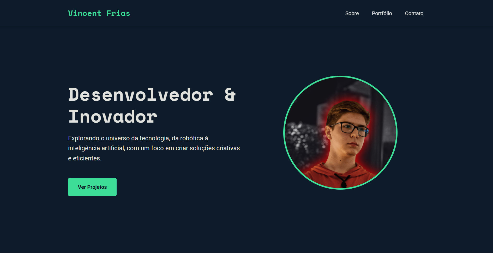

Portfólio Pessoal - Vincent Frias

❯ Descrição do Projeto
Este é o código-fonte do meu portfólio pessoal, desenvolvido para apresentar minhas habilidades, projetos e informações de contato de uma maneira moderna, profissional e responsiva. O site serve como um cartão de visitas digital, refletindo minha paixão por tecnologia, programação e design.

O projeto foi originalmente uma página simples e foi reestruturado aplicando teorias de design gráfico e desenvolvimento web para aprimorar a experiência do usuário (UX), a interface do usuário (UI) e a organização do código.

✨ Principais Funcionalidades
Design Responsivo: Totalmente adaptável a diferentes tamanhos de tela, de desktops a dispositivos móveis.

Navegação Intuitiva: Cabeçalho fixo com links que permitem uma rolagem suave (scroll-behavior) para as seções correspondentes.

Seção "Hero" Impactante: Uma primeira impressão forte com um título claro, uma breve biografia e uma foto de perfil destacada.

Seção de Portfólio Organizada: Apresenta projetos em um layout de grid com cartões interativos.

Microinterações: Efeitos sutis de hover e animações que melhoram o feedback visual e o engajamento do usuário.

Contato Facilitado: Links diretos para e-mail e redes sociais profissionais.

🎨 Conceitos de Design Aplicados
Este projeto foi um exercício prático na aplicação de princípios de design para criar uma interface mais eficaz e agradável:

Hierarquia Visual: A estrutura do conteúdo guia o olhar do usuário, começando pela seção "Hero" e seguindo uma narrativa lógica através das seções "Sobre", "Portfólio" e "Contato".

Teoria das Cores: Foi implementada uma paleta de cores coesa e profissional:

#0D1B2A (Azul Escuro): Transmite confiança e seriedade.

#3DDC97 (Verde Menta): Usado como cor de destaque (accent color) para chamar a atenção para elementos interativos como botões e links.

Cores neutras para garantir máxima legibilidade.

Tipografia Estratégica:

Space Mono: Para títulos, criando uma identidade visual ligada à tecnologia e programação.

Roboto: Para o corpo do texto, garantindo clareza e legibilidade em todas as plataformas.

Layout e Espaçamento (Whitespace): O uso de Flexbox e Grid CSS, combinado com um generoso espaçamento em branco, resulta em um design limpo, organizado e que não sobrecarrega o usuário.

🚀 Tecnologias Utilizadas
HTML5: Utilizando tags semânticas (<header>, <nav>, <section>, <footer>) para melhor estrutura e acessibilidade.

CSS3:

Variáveis CSS: Para um gerenciamento de cores e temas mais fácil e consistente.

Flexbox: Para alinhamento e distribuição de elementos no cabeçalho e outras seções.

Grid Layout: Para a criação de um layout de portfólio responsivo e alinhado.

Animações e Transições: Para adicionar interatividade e feedback visual.

Google Fonts: Para importar e utilizar as fontes customizadas Roboto e Space Mono.

📂 Estrutura do Projeto
/
├── index.html         # Arquivo principal com a estrutura do conteúdo do site
├── style.css          # Folha de estilos com todo o design e responsividade
├── fotos/
│   └── github_pic.png # Imagens utilizadas no projeto
└── README.md          # Este arquivo
🛠️ Como Executar o Projeto Localmente
Nenhuma instalação complexa é necessária. Basta seguir os passos abaixo:

Clone o repositório para a sua máquina local:

Bash

git clone https://github.com/VincentFrias/personal-website

Navegue até o diretório do projeto:

Bash

cd NOME-DO-REPOSITORIO
Abra o arquivo index.html no seu navegador de preferência.

E pronto! Você estará visualizando o site.

Desenvolvido por Vincent Frias.